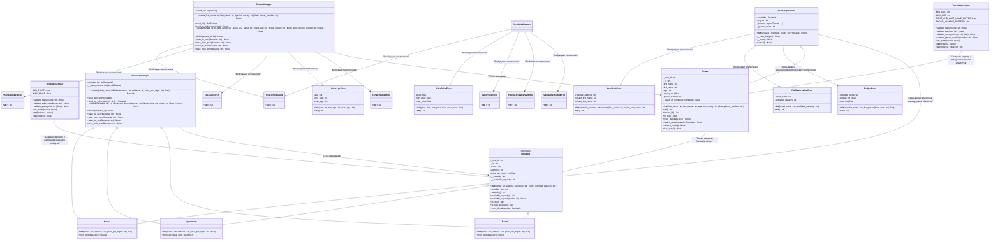

# Полная диаграмма классов

```mermaid
classDiagram
%% Классы Rentable-объетов
    class Rentable {
        <<Abstract>>
        -_next_id : int
        -_id : int
        -name : str
        -address : str
        -price_per_night : int | float
        -__capacity : int
        -__available_capacity : int
        +__init__(name : str, address : str, price_per_night : int| float, capacity: int)
        +rentable_id() int
        +capacity() int
        +available_capacity() int
        +available_capacity(value: int) None
        +to_dict() dict
        +is_fully_booked() bool
        +from_dict(data: dict) Rentable
    }

    class Room {
        +__init__(name : str, address : str, price_per_night : int | float)
        +from_dict(data: dict) Room
    }

    class Apartment {
        +__init__(name : str, address : str, price_per_night : int | float)
        +from_dict(data: dict) Apartment
    }

    class House {
        +__init__(name : str, address : str, price_per_night : int | float)
        +from_dict(data: dict) House
    }
    
%% Класс, который представляет арнедатора
	class Tenant { 
		-_next_id : int
		-_id : int  
		-first_name : str
		-last_name : str 
		-age : int 
		-money: int | float 
		-phone_number: str 
		-_place_of_residence: Rentable | None 
		+__init__(first_name : str, last_name : str, age : int, money : int | float, phone_number : str)
		+__str__() str
		+tenant_id() int 
		+to_dict() dict 
		+from_dict(data: dict) Tenant 
		+attach_rental(rentable: Rentable) None 
		+detach_rental() None
		+has_rental() bool 
	}

%% Дескрипторы
	class RentalDescriptor { 
		-MIN_PRICE : float
		-MAX_PRICE : float
		+validate_name(name: str) None
		+validate_address(address: str) None
		+validate_price(price: int | float) None 
		+__set_name__(owner, name) 
		+__get__(instance, owner) 
		+__set__(instance, value) 
	}

	class TenantDescriptor { 
		-MIN_AGE : int 
		-MAX_AGE : int
		-FIRST_AND_LAST_NAME_PATTERN : str 
		-PHONE_NUMBER_PATTERN : str
		+validate_name(name: str) None 
		+validate_age(age: int) None
		+validate_money(money: int | float) None 
		+validate_phone_number(number: str) None 
		+__set_name__(owner, name)
		+__get__(instance, owner) 
		+__set__(instance, value: int | str)
	}

%% Класс, который представляет договор аренды
	class RentalAgreement {
		-_rentable : Rentable
		-_nights : int
		-_tenants : tuple[Tenant, ...]
		-_guests_count : int
		+__init__(rentable : Rentable, nights : int, *tenants: Tenant) 
		-__chek_budget() None
		-__book() None
		+cancel() None 
	}

%% CRUD-менеджер Rentable-объектов
	class RentableMenager {
		-rentable_list: list[Rentable]
		-__class_names: dict[str, ABCMeta]
		+create(class_name: ABCMeta, name : str, address : str, price_per_night: int | float) Rentable
		+read_all() list[Rentable]
		+read_by_id(rentable_id : int): Rentable
		+update(rentable_id : int, name: str | None, address : str | None, price_per_night : int | float | None) None
		+delete(rentable_id)None
		+save_to_json(filename: str) None
		+load_from_json(filename: str) None 
		+save_to_xml(filename: str) None
		+load_from_xml(filename: str) None
	}
	
%% CRUD-менеджер Tenant-объектов
	class TenantManager {
		-tenant_list: list[Tenant]
		+create(first_name: str, last_name: str, age: int, money: int | float, phone_number: str) Tenant 
		+read_all() list[Tenant] 
		+read_by_id(tenant_id: int) Tenant 
		+update(tenant_id: int, first_name: str | None, last_name: str | None, age: int | None, money: int | float | None, phone_number: str |None) None 
		+delete(tenant_id: int) None
		+save_to_json(filename: str) None
		+load_from_json(filename: str) None
		+save_to_xml(filename: str) None
		+load_from_xml(filename: str) None
	}

%% Исключения Tenant-объектов
	class TenantNameError {
		+__str__() str 
	} 
	
	class ValueAgeError { 
		-age : int
		-min_age : int
		-max_age : int
		+__init__(age : int, min_age : int, max_age : int) 
		+__str__() str 
	} 
	
	class TypeAgeError {
		+__str__() str 
	} 
	
	class PhoneNumberError {
		+__str__() str
	}

%% Исключения Rentable-объектов
	class TypeNameRentalError {
		+__str__() str 
	}

	class TypeAddressRentalError { 
		+__str__() str 
	}

	class TypePriceError { 
		+__str__() str 
	}

	class ValuePriceError { 
		-price: float
		-min_price: float
		-max_price: float
		+__init__(price: float, min_price: float, max_price: float)
		+__str__() str 
	}

%% Исключения при CRUD-операциях
	class ObjectNotFound { 
		+__str__() str 
	}

%% Исключения при заключении договра
	class BudgetError { 
		-rentable_name: str
		-budget: int | float 
		-cost: int | float 
		+__init__(rentable_name : str, budget : int|float, cost : int | float) 
		+__str__() str 
	}

	class FullReservationError { 
		-rental_name: str 
		-available_capacity: int 
		+__init__(rental_name : str, available_capacity : int) 
		+__str__() str 
	}

	class HaveRentError { 
		-rentable_address: str 
		-tenant_first_name: str 
		-tenant_last_name: str 
		+__init__(rentable_address : str, tenant_first_name : str, tenant_last_name : str) 
		+__str__() str }

%% Связи Rentable-объектов
	Rentable <|-- Room 
	Rentable <|-- Apartment 
	Rentable <|-- House 
	Tenant -- Rentable : "Tenant арендует Rentable-объект"

%% Связи дескрипторов
	RentalDescriptor -- Rentable : "Создание property и валидация значений атрибутов"
	TenantDescriptor -- Tenant : "Создание property и валидация значений атрибутов"

%% Связи объектов, которые участвуют при заключении договора аренды
	RentalAgreement -- Rentable : "Связь между договором и арендуемым объектом"
	RentalAgreement o-- Tenant : "Связь между арендаторм и договорм"

%% Связь CRUD-менеджера с Tenant-объектами
	TenantManager --> Tenant : "CRUD-менеджер"

%% Связи исключений с соответствующим CRUD-менеджером
	TenantManager --> TenantNameError : "Возбуждает исключение"
	TenantManager --> ValueAgeError : "Возбуждает исключение"
	TenantManager --> TypeAgeError : "Возбуждает исключение"
	TenantManager --> PhoneNumberError : "Возбуждает исключение"
	TenantManager --> ObjectNotFound : "Возбуждает исключение"

%% Связи CRUD-менеджера с Rentable-объектами
	RentableMenager --> Rentable : "CRUD-менеджер"
	RentableMenager o-- Room
	RentableMenager o-- Apartment
	RentableMenager o-- House

%% Связи исключений с соответствующим CRUD-менеджером
	RentableManager --> TypeNameRentalError : "Возбуждает исключение"
	RentableManager --> TypeAddressRentalError : "Возбуждает исключение"
	RentableManager --> TypePriceError : "Возбуждает исключение"
	RentableManager --> ValuePriceError : "Возбуждает исключение"
	RentableManager --> ObjectNotFound : "Возбуждает исключение"

%% Связи исключений при бронировании
	RentalAgreement --> BudgetError : "Возбуждает исключение"
	RentalAgreement --> FullReservationError : "Возбуждает исключение"
	RentalAgreement --> HaveRentError : "Возбуждает исключение"
```