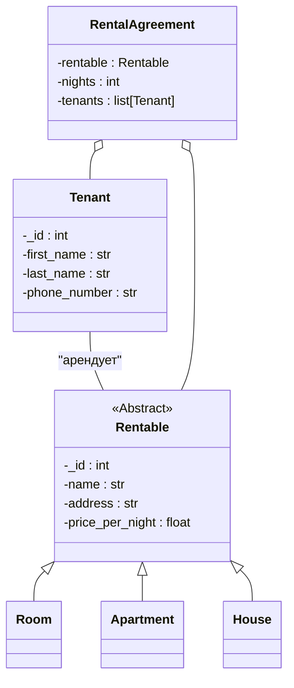
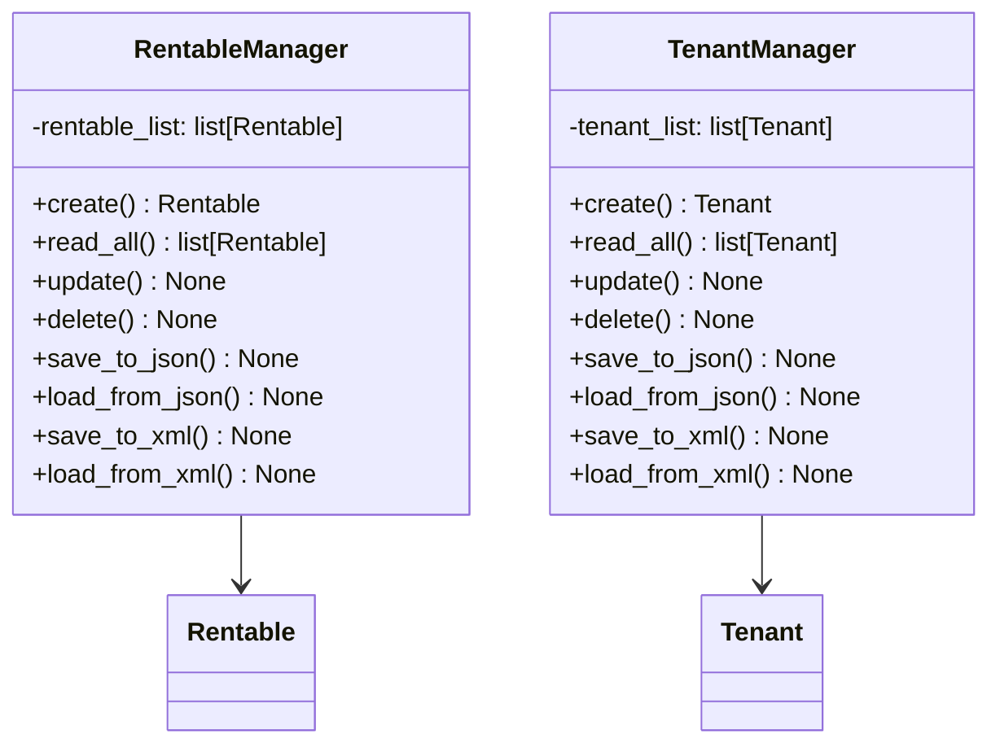
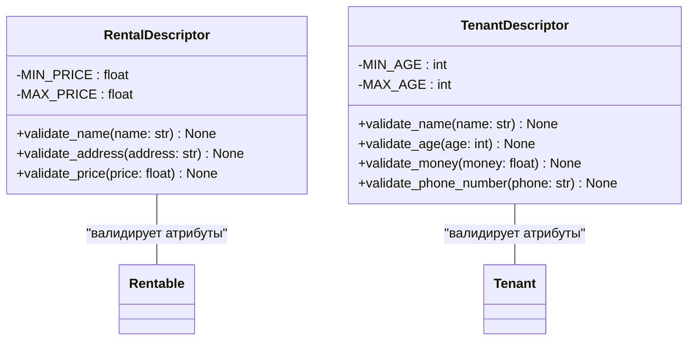
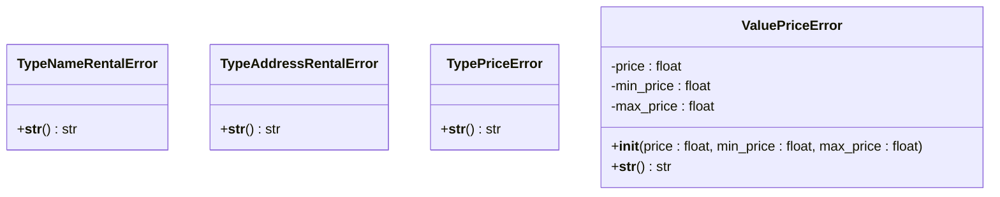
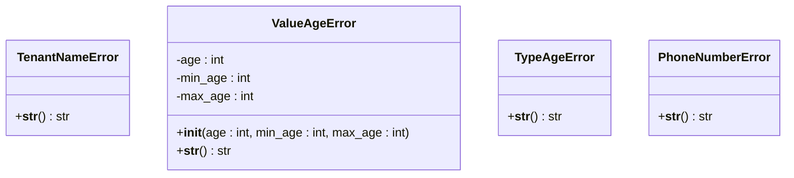
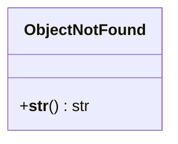
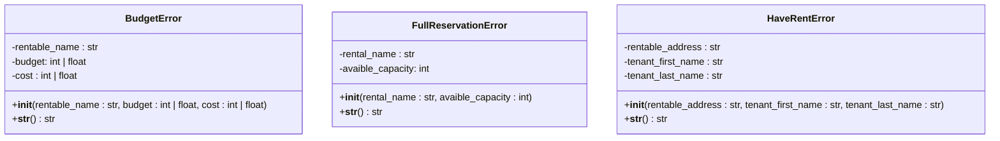

# Упрощённая диаграмма классов
## Ключевые классы

## CRUD-менеджеры

## Дескрипторы

## Исключения объектов Rentable

## Исключения объектов Tenant

## Исключения при CRUD-операциях

## Исключение при бронировании жилья
